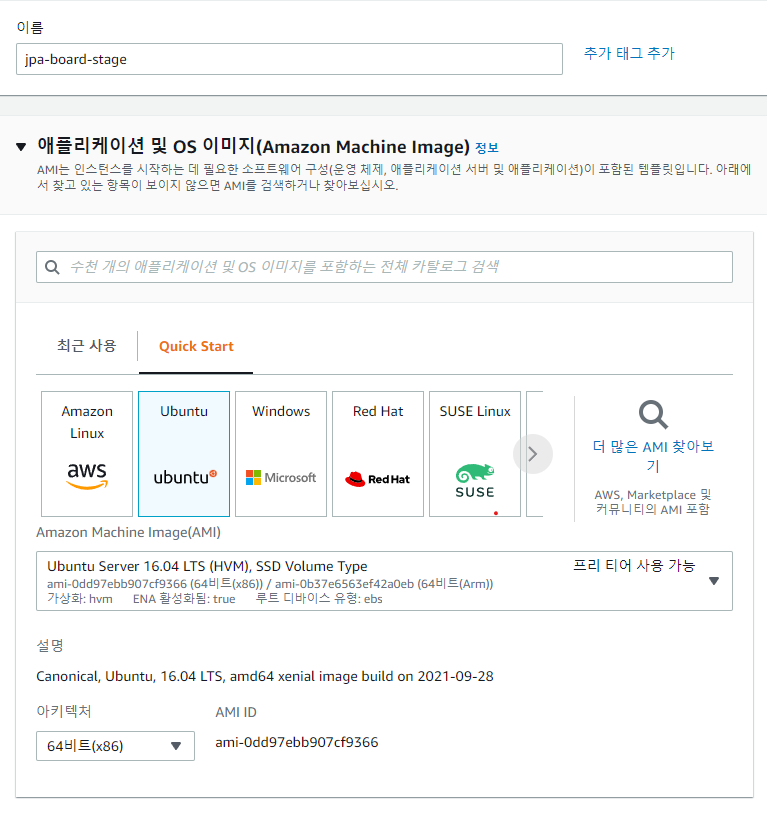

# aws ec2 환경을 구축해보자
## 1. EC2 인스턴스 생성
### 1-1. EC2 - 인스턴스 시작 클릭
>  
### 1-2. 인스턴스 시작 마법사 시작
>  
### 1-3. 이름과 AMI 설정
>여기서는 ubuntu 16.04 LTS 버전을 사용했다.  
>  
### 1-4. 키 페어 등록
> - 등록된 키 페어가 없을 경우 새 키 페어 생성을 클릭해 키를 생성한다.  
> - 여기서는 RSA 방식의 .pem 키 페어를 사용했다.  
> - 다른 설정은 건들지 않는다.
>  
### 1-5. 인스턴스 생성 완료
>  
## 2. ssh로 EC2 접속
### 2-1. MobaXterm 다운로드
- https://mobaxterm.mobatek.net/
### 2-2. Session - SSH 클릭
>  
### 2-3. 연결 정보 입력
> - Remote host에 1-5의 public ip를 입력한다.  
> - Specify username을 체크하고 ubuntu를 입력한다.  
> - Advanced SSH settings - Use private key를 체크하고 저장한 키페어 파일을 선택한다.  
>  
### 2-4. 연결 성공
>  