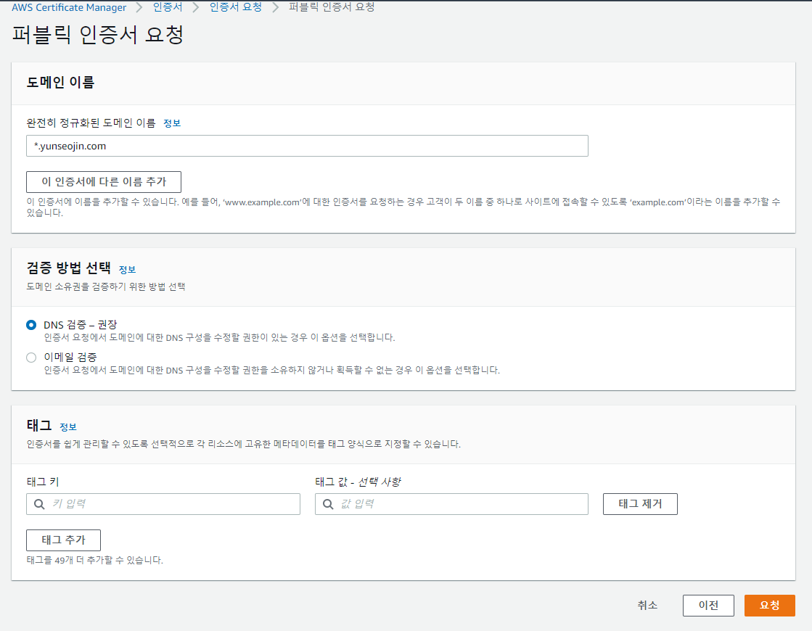
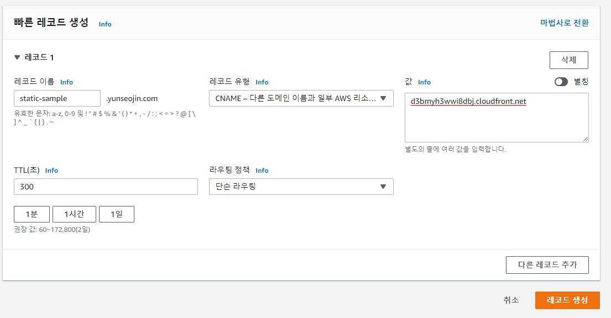

# aws s3 환경을 구축하자
## [전체 AWS 문서](index.md)
## 1. 버킷 생성
### 1-1. s3에 접속해서 버킷 만들기 클릭
>  
### 1-2. 버킷 이름과 리전, 객체 소유권 설정
>  
> ACL을 활성화해야 객체의 개별 권한을 설정할 수 있다.  
### 1-3. 퍼블릭 액세스 차단 해제
>  
### 1-4. 버킷 생성
> 버킷 생성이 완료되면 cloudfront로 이동한다.  
## 2. CloudFront 생성
> 클라우드 프론트란 AWS에서 제공하는 CDN(CContent Distribution Network) 서비스이다.  
> CDN은 지리적 제약 없이 빠르게 콘텐츠를 전송하는 기술로  
> 원리는 각 지역마다 캐시 서버를 설치한 뒤 사용자의 요청이 발생하면  
> 사용자와 가까운 캐시 서버에서 콘텐츠를 전송하는 프록시 서버의 일종이다.  
### 2-1. 배포 생성 클릭
>  
### 2-2. 원본 도메인 선택
>  
> 생성한 S3를 선택한다.  
### 2-3. https 리다이렉트 설정
>  
> http로 접속한 경우 https로 리다이렉트 될 수 있도록 옵션을 선택한다.  
### 2-4. 대체 도메인 설정
>  
> 간략화된 주소로 접근할 수 있도록 사용할 대체 도메인을 선택한다.  
> 이 CNAME은 추후에 route 53의 호스팅 영역에 추가해야한다.  
### 2-5. 인증서 요청
#### 2-5-1. 인증서 요청을 클릭한다.
>  
#### 2-5-2. 다음을 클릭한다.
>  
#### 2-5-3. *.도메인, DNS 검증을 선택하고 요청한다.
>  
#### 2-5-4. 인증서를 요청하면 검증 대기 중으로 전환된다.
>  
#### 2-5-5. 기다리면 발급됨으로 전환된다.
>  
### 2-6. 인증서 선택
> 발급한 ACM 인증서를 선택한다.  
>  
### 2-7. CloudFront 생성 완료
>  
## 3. CNAME 생성
> 사전에 등록된 도메인이 존재해야 한다. [참조](/aws/도메인%20구입.md)
### 3-1. route 53-호스팅 영역에 접속해 레코드 생성을 클릭
>  
### 3-2. 레코드 생성
> 레코드 이름은 2-4에서 입력한 대체 도메인 이름  
> 레코드 유형은 CNAME  
> 값은 2-7의 도메인 이름을 입력한다.  
>  
## 4. S3에 파일 업로드
### 4-1. 폴더 만들기 클릭
>  
### 4-2. 설정을 건들지 않고 폴더 생성
>  
### 4-3. 생성한 폴더에 들어가서 업로드 클릭
>  
### 4-4. 업로드할 파일 추가
>  
### 4-5. 권한 선택
> 테스트를 위해 퍼블릭 읽기 액세스 권한 부여  
>  
### 4-6. 테스트 완료
>  

## [맨 위로](#)