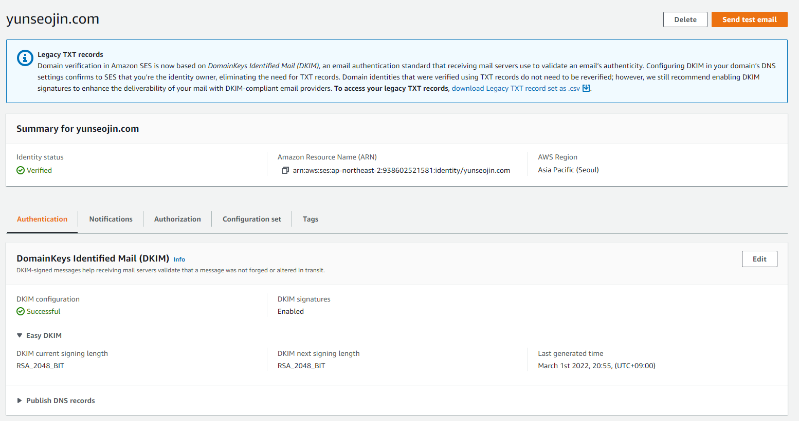

# AWS SES(Simple Email Service)를 사용해보자

### 1. ses 접속

>이전에 작성된 문서에서 gui가 변경되었다. 이후 내용은 직접 찾아서 작성했다.
### 2. Create indentity 클릭
## 1. 이메일 주소 사용
### 1-1. identity 생성

   - Identity type을 Email로 선택한다.
   - 소유하고 있는 email을 입력한다.
   - (선택) 태그를 추가한다.
     - key : 카테고리
     - value : 설명
### 1-2. 이메일 인증  
>create identity를 클릭하면 입력한 이메일로 인증 메일이 발송된다.
>
>중간에 링크를 클릭하면 인증이 완료된다.

### 1-3. 테스트 이메일 전송
  
custom scenario를 선택하고 이메일을 보내면

이메일을 전송한 것을 확인할 수 있다.  
이 경우 발송 도메인은 amazonses.com이 된다.
## 2. 도메인 사용
### 2-1. identity 생성

domain을 선택하고 route 53에 등록된 도메인을 입력한다.

등록하고 기다리면 aws가 알아서 route 53에 등록된 도메인에 mx와 txt를 생성해준다.

그 후 인증이 완료된다.

테스트 메일까지 성공적으로 전송됐다.

## 3. api로 이메일 보내기
sdk를 사용하기 위해서는 사용자 보안 그룹에 ses를 추가해주어야 한다.


### 3-1. 보안키 설정
AWS_ACCESS_KEY_ID, AWS_SECRET_KEY를 설정파일에 입력한다.  


### 3-2. 의존성 설정
com.amazonaws:aws-java-sdk-ses를 추가한다.  


### 3-3. AwsSesConfig 파일 생성
```java
@Configuration
public class AwsSesConfig {
    @Value("${AWS_ACCESS_KEY_ID}")
    private String AWS_ACCESS_KEY_ID;
    @Value("${AWS_SECRET_KEY}")
    private String AWS_SECRET_KEY;

    @Bean
    public AmazonSimpleEmailServiceAsync amazonSimpleEmailServiceAsync(){
        var basicAWSCredentials = new BasicAWSCredentials(AWS_ACCESS_KEY_ID, AWS_SECRET_KEY);

        return AmazonSimpleEmailServiceAsyncClient.asyncBuilder()
                .withCredentials(new AWSStaticCredentialsProvider(basicAWSCredentials))
                .withRegion(Regions.AP_NORTHEAST_2) // 생성한 ses의 지역을 입력한다.
                .build();
    }
}
```

### 3-4. SesServiceImpl 작성
```java
@RequiredArgsConstructor
@Service
public class SesServiceImpl implements SesService {
    private final AmazonSimpleEmailServiceAsync amazonSimpleEmailServiceAsync;

    @Override
    public void sendMail(String from, String to, String subject, String htmlbody) {
        var body = new Content()
                .withCharset("UTF-8")
                .withData(htmlbody);

        var sub = new Content()
                .withCharset("UTF-8")
                .withData(subject);

        var dest = new Destination().withToAddresses(to);

        var msg = new Message()
                .withBody(new Body().withHtml(body))
                .withSubject(sub);

        var request = new SendEmailRequest()
                .withDestination(dest)
                .withMessage(msg)
                .withSource(from);

        if (amazonSimpleEmailServiceAsync == null)
            System.out.println("is null");

        amazonSimpleEmailServiceAsync.sendEmailAsync(request);

        System.out.println("Email sent!");
    }
}
```

### 3-5. SesController 작성
```java
@RequiredArgsConstructor
@RestController
public class SesController {
    private final SesService sesService;

    @PostMapping("/send")
    public ResponseEntity<Void> send() {
        sesService.sendMail("test@yunseojin.com", "tkaltk123@gmail.com", "test", "test");
        return new ResponseEntity<>(HttpStatus.OK);
    }
}
```

### 3-6. 확인

스프링으로 ses를 사용해 이메일을 보낼 수 있다.