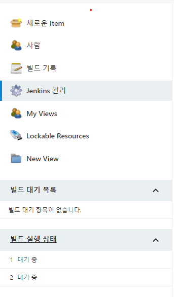

# 젠킨스 로컬 환경을 구축해보자.
## [전체 젠킨스 문서](index.md)
## 1. 빌드서버에 젠킨스 설치
  - [EC2 환경에 설치](jenkins_with_ec2.md)
  - [docker 환경에 설치](jenkins_with_docker.md)
## 2. 스테이지 서버에 톰캣 설치
  - [참조](tomcat.md)
## 3. 빌드서버와 스테이지 서버 키 교환
  - [참조](ssh_key_transfer.md)
## 4. 젠킨스 초기 설정
### 4.1. 브라우저를 통해 젠킨스 접속
```
http://host:port
```
### 4.2. 초기 비밀번호 입력
> [1.1. 참조](#1-빌드서버에-젠킨스-설치)
>  
### 4.3. Install Suggested plugins 클릭
>  
### 4.4. admin 계정 정보 입력
> 다운로드가 완료되면 admin 계정 정보를 입력하고 실행한다.
> 

## 5. 젠킨스 플러그인 설치 및 설정
### 5.1. Jenkins 관리 - 플러그인 관리 접속
> 
> 
### 5.2. Deploy to container와 publish over ssh 설치
> 선택 후 Download now and install after restart 클릭
> 
### 5.3. 설치 완료 후 Jenkins 재시작
> 
### 5.4. jenkins 관리 - 시스템 설정 - Publish over SSH 설정
> 

- Passphrase
  - 키 생성 시 입력한 Passphrase
  - 이 문서에서는 공백이다.
- Path to key  
  - 빌드서버에서 생성한 개인키의 위치
  - [1.1. 참조](#1-빌드서버에-젠킨스-설치)
- Key
  - 빌드서버가 사용할 개인키
  - Path to key를 입력했으면 입력할 필요가 없다.
- SSH Servers
  - Name
    - 식별할 수 있는 이름
  - Hostname
    - 스테이지 서버의 ip
  - Username
    - 해당 호스트의 이름
    - 이 문서에서는 tomcat이다.
  - Remote Directory
    - tomcat이 설치된 경로
    - 이 문서에서는 `/opt/tomcat/latest` 이다.
> Test Configuration을 눌러서 Success가 뜨면 성공이다. 저장해주자.

## 6. 전역 설정
### 6.1. Jenkins 관리 - Global Tool Configuration
> 
### 6.2. JDK 경로 설정
- Install automatically 체크 해제
- Name에 JDK 입력
- JAVA_HOME 입력
   ```
   cd $JAVA_HOME
   pwd
   ```
> 
### 6.3. 빌드 도구 설정
- gradle
  - Name에 GRADLE 입력
  - 직접 설치했을 경우 Install automatically를 체크 해제하고 gradle_home 입력
  - 설치되지 않은 경우 설치하고자 하는 버전 선택
  > 
- maven
  - gradle과 같은 방식으로 설정
## 7. 작업 생성
### 7.1. freestype project 생성
- 새로운 Item - Freestyle project
- 식별 가능한 이름 입력 후 OK
> 
### 7.2. 빌드할 소스코드 설정
- 소스 코드 관리 - Git
- Repository URL
  - 빌드할 소스코드 URL
- Credentials
  - Github 인증정보
> 
- Credentials 추가
  - Add - Jenkins 선택
  - Kind - Username with password 선택
  - 저장소에 접근할 수 있는 username과 password 입력
  - 식별자 입력 후 Add
> 
### 7.3. 빌드 후 배포 설정
- 빌드 환경 - Send files or execute commands over SSH after the build runs
- Transfers
  - Source files
    - 복사할 파일 경로
    - 이 문서에서는 `build/libs/ROOT.war`
  - Remove prefix
    - 제거할 접두사
    - 이 문서에서는 build/libs
  - Remote directory
    - 파일이 복사될 원격 위치
    - `/opt/tomcat/latest` 까지는 ssh server에 정의해두었기 때문에 'webapps'만 입력
> 
### 7.4. 설정 파일 복사
- Build - Execute shell 추가
- 설정파일 복사 커맨드 추가
```
cp /var/jenkins_home/deploy/config/application.yml ${WORKSPACE}/src/main/resources
```
- 빌드서버에 설정이 저장될 디렉토리 생성
```
su jenkins
cd
mkdir deploy
mkdir deploy/config
```
- 빌드서버에 설정파일 복사
```
cd deploy/config
vi application.yml
#copy
```
> 
### 7.5. 빌드 설정
- Build - Invoke Gradle script
- Invoke Gradle
- [6.3.](#63-빌드-도구-설정)에서 설정한 gradle 선택
- Tasks에 clean bootWar 추가
> 
### 7.6. 저장
### 7.7. 빌드
- project - Build Now
> 

### 7.8. 빌드 결과
```
Started by user SeojinYun
Running as SYSTEM
Building in workspace /var/jenkins_home/workspace/jenkins_test
The recommended git tool is: NONE
using credential tkaltk123
 > git rev-parse --resolve-git-dir /var/jenkins_home/workspace/jenkins_test/.git # timeout=10
Fetching changes from the remote Git repository
 > git config remote.origin.url https://github.com/tkaltk123/jpa_prac # timeout=10
Fetching upstream changes from https://github.com/tkaltk123/jpa_prac
 > git --version # timeout=10
 > git --version # 'git version 2.30.2'
using GIT_ASKPASS to set credentials 
 > git fetch --tags --force --progress -- https://github.com/tkaltk123/jpa_prac +refs/heads/*:refs/remotes/origin/* # timeout=10
 > git rev-parse refs/remotes/origin/master^{commit} # timeout=10
Checking out Revision 3f29ed40a9a22c6acb43efafe922e03e49dcef8b (refs/remotes/origin/master)
 > git config core.sparsecheckout # timeout=10
 > git checkout -f 3f29ed40a9a22c6acb43efafe922e03e49dcef8b # timeout=10
Commit message: "war 빌드로 변"
 > git rev-list --no-walk 3f29ed40a9a22c6acb43efafe922e03e49dcef8b # timeout=10
[jenkins_test] $ /bin/sh -xe /tmp/jenkins7584048676460638664.sh
+ cp /var/jenkins_home/deploy/config/application.yml /var/jenkins_home/workspace/jenkins_test/src/main/resources
[Gradle] - Launching build.
[jenkins_test] $ /var/jenkins_home/tools/hudson.plugins.gradle.GradleInstallation/GRADLE/bin/gradle clean bootWar

Welcome to Gradle 7.3.3!

Here are the highlights of this release:
 - Easily declare new test suites in Java projects
 - Support for Java 17
 - Support for Scala 3

For more details see https://docs.gradle.org/7.3.3/release-notes.html

Starting a Gradle Daemon (subsequent builds will be faster)
> Task :clean
> Task :compileJava
#워닝#
4 warnings
> Task :processResources
> Task :classes
> Task :bootWarMainClassName
> Task :bootWar

BUILD SUCCESSFUL in 1m 18s
5 actionable tasks: 5 executed
Build step 'Invoke Gradle script' changed build result to SUCCESS
SSH: Connecting from host [14beda7677c5]
SSH: Connecting with configuration [jenkins-ssh] ...
SSH: Disconnecting configuration [jenkins-ssh] ...
SSH: Transferred 1 file(s)
Finished: SUCCESS
```
> 다음과 같이 출력되면 빌드 성공  
> SSH: Transferred 1 file(s)  
> Finished: SUCCESS
- 스테이지 서버에 ROOT.war가 복사된 것을 확인할 수 있다.
> 
## [맨 위로](#)