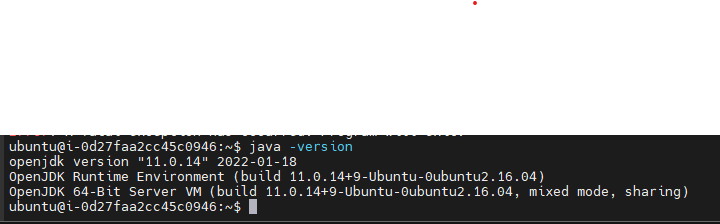
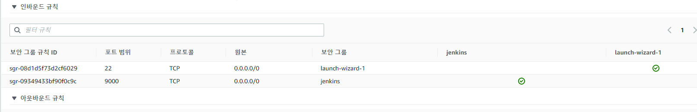

# EC2에 젠킨스를 설치하자.
## [전체 젠킨스 문서](index.md)
> 사전에 EC2 인스턴스를 생성해야 한다. [참조](//aws/aws%20ec2.md)
## 1. 젠킨스 설치
### 1.1. jdk 설치
> 다음 명령을 터미널에서 실행한다.  
```linux
sudo apt update

sudo apt upgrade
sudo apt install openjdk-xx-jdk
```
> xx에는 사용할 jdk 버전을 입력한다.  
> ubuntu 16.04에서 jdk 11을 사용하기 위해선 다음 명령을 실행한다.
```linux
sudo apt update

sudo apt upgrade
sudo add-apt-repository ppa:openjdk-r/ppa
sudo apt-get update
sudo apt install openjdk-11-jdk
```
> 설치 확인
>  

## 1.2. 젠킨스 설치
> 다음 명령을 터미널에서 실행한다.
```
sudo sh -c 'echo deb https://pkg.jenkins.io/debian-stable binary/> /etc/apt/sources.list.d/jenkins.list'

sudo apt-get update
sudo apt-get install jenkins
```
> `systemctl status jenkins` 을 입력하면 설치 여부를 확인할 수 있다.
### 1.3. 젠킨스 접속 포트 설정
> `sudo vi /etc/default/jenkins` 을 사용하면 포트 등의 젠킨스 설정을 변경할 수 있다.  
> 이후 `sudo service jenkins restart` 를 입력해 젠킨스를 재실행한다.  
> 그리고 EC2 인스턴스에서 젠킨스가 실행된 포트의 인바운드 규칙을 추가해준다.
>  
> public ip:설정한 포트(기본 8080)을 브라우저에 입력하면 젠킨스에 접속할 수 있다.  
### 1.4. 초기 비밀번호 위치
```
/var/lib/jenkins/secrets/initialAdminPassword
```
### 1.5. 생성된 키페어 위치
```
/var/lib/jenkins/.ssh/id_rsa
```

## [맨 위로](#)