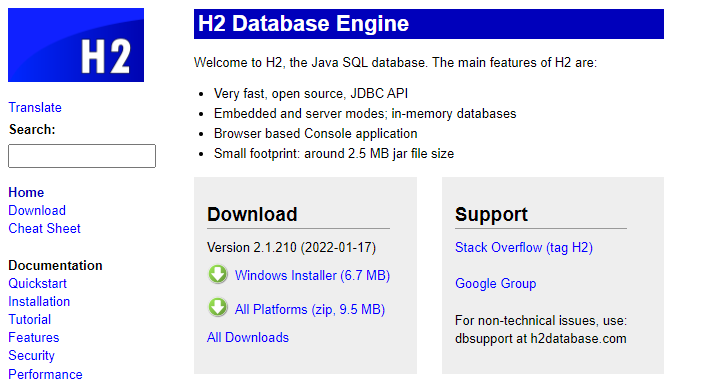
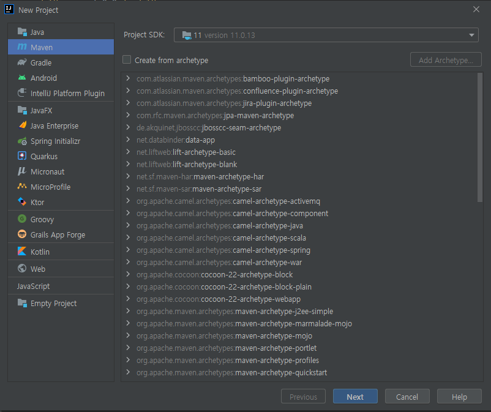
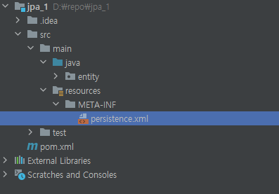

# 2장 JPA 시작
## [전체 JPA 문서](index.md)

## [코드](https://github.com/tkaltk123/jpa_study_1)

## 2.1 이클립스 설치와 프로젝트 불러오기 
- 생략
## 2.2 H2 데이터베이스 설치 
- [H2 DB 다운로드](www.h2database.com)
- 
- [http://localhost:8082/](http://localhost:8082/) 접속 
- 다음 SQL 실행
```
  CREATE TABLE MEMBER(
  ID VARCHAR(255) NOT NULL,
  NAME VARCHAR(255),
  AGE INTEGER NOT NULL,
  PRIMARY KEY(ID)
);
```
## 2.3 라이브러리와 프로젝트 구조 
1. 메이븐 프로젝트 생성 
   - 
2. pom.xml에 다음 의존성 추가
```xml
<!-- JPA, 하이버네이트-->
<dependency>
    <groupId>org.hibernate</groupId>
    <artifactId>hibernate-entitymanager</artifactId>
    <version>4.3.10.Final</version>
</dependency>
<!-- H2 DB-->
<dependency>
    <groupId>com.h2database</groupId>
    <artifactId>h2</artifactId>
    <version>1.4.187</version>
</dependency>
``` 
## 2.4 객체 매핑 시작 
- MemberEntity 추가
```java
package entity;

import javax.persistence.Column;
import javax.persistence.Entity;
import javax.persistence.Id;
import javax.persistence.Table;

@Entity
@Table(name = "MEMBER")
public class MemberEntity {
    @Id
    @Column(name = "ID")
    private String id;

    @Column(name = "NAME")
    private String name;

    private Integer age;    
    
    @Override
    public String toString() {
        return "id : " + id + ", name : " + name + ", age : " + age.toString();
    }

    public String getId() {
        return id;
    }

    public void setId(String id) {
        this.id = id;
    }

    public String getName() {
        return name;
    }

    public void setName(String name) {
        this.name = name;
    }

    public Integer getAge() {
        return age;
    }

    public void setAge(Integer age) {
        this.age = age;
    }
}

```
- @Entity
  - 테이블과 매핑될 클래스를 의미
  - @Entity가 추가된 클래스를 엔티티 클래스라 한다.
- @Table
  - 엔티티 클래스와 매핑할 테이블 정보를 알려준다.
  - 여기서는 name 속성을 사용해 매핑할 테이블의 이름을 명시했다.
- @Id
  - 테이블의 기본키와 매핑할 필드를 의미
  - @Id가 사용된 필드를 식별자 필드라 한다.
- @Column
  - 필드와 매핑할 컬럼의 정보를 알려준다.
  - 여기서는 name 속성을 사용해 매핑할 컬럼의 이름을 명시했다.
  - @Column이 없으면 필드명을 사용해 매핑한다.
## 2.5 persistence.xml 설정 
- resources/META-INF/persistence.xml 생성
  - 
```xml
<?xml version="1.0" encoding="UTF-8"?>
<persistence xmlns="http://xmlns.jcp.org/xml/ns/persistence" version="2.1">
    <persistence-unit name="jpa_1">
        <properties>
            <!-- 필수-->
            <property name="javax.persistence.jdbc.driver" value="org.h2.Driver"/>
            <property name="javax.persistence.jdbc.user" value="sa"/>
            <property name="javax.persistence.jdbc.password" value=""/>
            <property name="javax.persistence.jdbc.url" value="jdbc:h2:tcp://localhost/~/test"/>
            <property name="hibernate.dialect" value="org.hibernate.dialect.H2Dialect"/>
            <!-- 선택-->
            <property name="hibernate.show_sql" value="true"/>
            <property name="hibernate.format_sql" value="true"/>
            <property name="hibernate.use_sql_comments" value="true"/>
            <property name="hibernate.id.new_generator_mappings" value="true"/>
        </properties>
    </persistence-unit>
</persistence>
```
- hibernate.show_sql
  - 하이버네이트가 실행한 SQL을 출력한다.
- hibernate.format_sql
  - show_sql을 설정할 경우 보기 쉽게 정렬한다.
- hibernate.use_sql_comments
  - SQL을 출력할 때 주석도 함께 출력한다.
- hibernate.id.new_generator_mappings
  - JPA의 키 생성 전략을 사용한다.
### 2.5.1 데이터베이스 방언 
- 데이터베이스들은 같은 기능이더라도 문법과 함수가 조금씩 다르고 JPA는 이를 데이터베이스 방언이라고 표현한다.
- SQL을 직접 다룰경우 데이터베이스마다 다른 구현 때문에 다른 데이터베이스로 교체하기 어려운 문제가 있기 때문에 JPA는 이를 해결하기 위해 JPA 표준 문법으로 개발하고 이후 데이터베이스 방언만 교체하는 방식으로 해결했다.
## 2.6 애플리케이션 개발 
- JpaMain 생성
```java
import javax.persistence.EntityManager;
import javax.persistence.Persistence;

public class JpaMain {
    public static void main(String[] args) {
        // 엔티티 매니저 팩토리 생성
        var emf = Persistence.createEntityManagerFactory("jpa_1");
        // 엔티티 매니저 생성
        var em = emf.createEntityManager();
        // 트랜잭션 획득
        var tran = em.getTransaction();
        try {
            tran.begin();
            logic(em);
            tran.commit();
        } catch (Exception e) {
            tran.rollback();
        } finally {
            em.close();
        }
        emf.close();
    }

    private static void logic(EntityManager em) {

    }
}

```
### 2.6.1 엔티티 매니저 설정 
- 엔티티 매니저 팩토리
  - `Persistence.createEntityManagerFactory("@unitname");`을 실행하면 persistence.xml에서 이름이 @unitname인 persistence-unit을 찾아 엔티티 매니저 팩토리를 생성해준다.
  - 엔티티 매니저 팩토리는 생성 비용이 아주 크기 때문에 애플리케이션 전체에서 딱 한번만 생성하고 공유해서 사용해야 한다.
  - 사용이 끝난 엔티티 매니저 팩토리는 close()를 호출해 종료해주어야 한다.
- 엔티티 매니저
  - 생성된 엔티티 매니저 팩토리를 사용해 엔티티 매니저를 생성할 수 있다.
  - JPA의 기능 대부분을 제공하며 데이터베이스 커넥션과 밀접한 관련이 있기 때문에 스레드 간에 공유하거나 재사용하면 안 된다.
  - 사용이 끝난 엔티티 매니저는 close()를 호출해 종료해주어야 한다.
### 2.6.2 트랜잭션 관리 
- JPA는 트랙잭션 없이 데이터를 변경하면 예외가 발생하므로 엔티티 매니저에서 트랜잭션을 받아와 사용해야 한다.
### 2.6.3 비즈니스 로직 
```java
    private static void logic(EntityManager em) {
        var id = "id1";
        var member = new MemberEntity();
        member.setId(id);
        member.setName("서진");
        member.setAge(24);

        //등록
        em.persist(member);

        //수정
        member.setAge(25);

        //단일 조회
        var findMember = em.find(MemberEntity.class, id);
        System.out.println("findMember = " + findMember.toString());

        //목록 조회
        var members = em.createQuery("select m from MemberEntity m", MemberEntity.class).getResultList();
        System.out.println("members.size = " + members.size());

        //삭제
        em.remove(member);
    }
```
- 출력 결과
```sql
findMember = id : id1, name : 서진, age : 25
Hibernate: 
    /* insert entity.MemberEntity
        */ insert 
        into
            MEMBER
            (age, NAME, ID) 
        values
            (?, ?, ?)
Hibernate: 
    /* update
        entity.MemberEntity */ update
            MEMBER 
        set
            age=?,
            NAME=? 
        where
            ID=?
Hibernate: 
    /* select
        m 
    from
        MemberEntity m */ select
            memberenti0_.ID as ID1_0_,
            memberenti0_.age as age2_0_,
            memberenti0_.NAME as NAME3_0_ 
        from
            MEMBER memberenti0_
members.size = 1
Hibernate: 
    /* delete entity.MemberEntity */ delete 
        from
            MEMBER 
        where
            ID=?
```
### 2.6.4 JPQL 
- 회원 목록을 조회하는 코드에서 `select m from MemberEntity m` 이 부분을 JPQL이라고 한다.
- JPA API는 엔티티 객체에만 사용할 수 있기 때문에 특정 범위의 데이터를 조회하려면 우선 모든 데이터를 엔티티 객체로 변환해야하고 이는 현실적으로 불가능 하다.
- 때문에 JPA는 SQL을 추상화한 JPQL을 사용해 아직 엔티티 객체로 변환되지 않은 데이터들을 엔티티 객체처럼 다룰 수 있게 했다.

## [맨 위로](#)