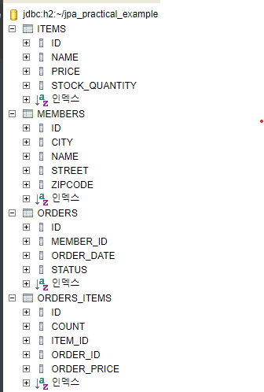

# 실전 예제 1. 요구사항 분석과 기본 매핑  
## [전체 JPA 문서](index.md)
## [4. 엔티티 매핑](4.엔티티매핑.md#실전-예제-1-요구사항-분석과-기본-매핑)
## [코드](https://github.com/tkaltk123/jpa_practical_example)

## 1. 요구사항 분석 
- 요구사항
  - 회원은 상품을 주문할 수 있다.
  - 주문 시 여러 종류의 상품을 선택할 수 있다.
- 기능
  - 회원 기능
    - 회원 등록
    - 회원 조회
  - 상품 기능
    - 상품 등록
    - 상품 수정
    - 상품 조회
  - 주문 기능
    - 상품 주문
    - 주문 내역 조회
    - 주문 취소
## 2. 도메인 모델 분석 
- 회원 - 주문
  - 회원은 여러 번 주문할 수 있으므로 1:N 관계이다.
- 주문 - 상품
  - 한 주문에는 여러 상품이 있을 수 있고, 한 상품은 여러 주문에 포함될 수 있기 때문에 N:M 관계이다.
  - 때문에 N:M 관계를 표현하기 위한 주문상품 테이블이 필요하다.
## 3. 테이블 설계 
- MEMBERS
  - ID(PK) : LONG
  - NAME : STRING
  - CITY : STRING
  - STREET : STRING
  - ZIPCODE : STRING
- ORDERS
  - ID(PK) : LONG
  - MEMBER_ID(FK) : LONG
  - ORDER_DATE : DATE
  - STATUS : STRING
- ITEMS
  - ID(PK) : LONG
  - NAME : STRING
  - PRICE : INT
  - STOCK_QUANTITY : INT
- ORDERS_ITEMS
  - ID(PK) : LONG
  - ORDER_ID(FK) : LONG
  - ITEM_ID(FK) : LONG
  - ORDER_PRICE : INT
  - COUNT : INT
## 4. 엔티티 설계와 매핑 
- MemberEntity
```java
package entity;

import javax.persistence.*;

@Entity
@Table(name = "MEMBERS")
public class MemberEntity {
    @Id
    @GeneratedValue(strategy = GenerationType.AUTO)
    @Column(name = "ID", nullable = false)
    private Long id;

    @Column(name = "NAME")
    private String name;

    @Column(name = "CITY")
    private String city;

    @Column(name = "STREET")
    private String street;

    @Column(name = "ZIPCODE")
    private String zipcode;

    public Long getId() {
        return id;
    }

    public void setId(Long id) {
        this.id = id;
    }

    public String getName() {
        return name;
    }

    public void setName(String name) {
        this.name = name;
    }

    public String getCity() {
        return city;
    }

    public void setCity(String city) {
        this.city = city;
    }

    public String getStreet() {
        return street;
    }

    public void setStreet(String street) {
        this.street = street;
    }

    public String getZipcode() {
        return zipcode;
    }

    public void setZipcode(String zipcode) {
        this.zipcode = zipcode;
    }
}
```
- OrderEntity
```java
package entity;

import util.OrderStatus;

import javax.persistence.*;
import java.util.Date;

@Entity
@Table(name = "ORDERS")
public class OrderEntity {
    @Id
    @GeneratedValue(strategy = GenerationType.AUTO)
    @Column(name = "ID", nullable = false)
    private Long id;

    @Column(name = "MEMBER_ID")
    private Long memberId;

    @Temporal(TemporalType.TIMESTAMP)
    @Column(name = "ORDER_DATE")
    private Date orderDate;

    @Enumerated(EnumType.STRING)
    @Column(name = "STATUS")
    private OrderStatus status;

    public Long getId() {
        return id;
    }

    public void setId(Long id) {
        this.id = id;
    }

    public Long getMemberId() {
        return memberId;
    }

    public void setMemberId(Long memberId) {
        this.memberId = memberId;
    }

    public Date getOrderDate() {
        return orderDate;
    }

    public void setOrderDate(Date orderDate) {
        this.orderDate = orderDate;
    }

    public OrderStatus getStatus() {
        return status;
    }

    public void setStatus(OrderStatus status) {
        this.status = status;
    }
}
```
- ItemEntity
```java
package entity;

import javax.persistence.*;

@Entity
@Table(name = "ITEMS")
public class ItemEntity {
    @Id
    @GeneratedValue(strategy = GenerationType.AUTO)
    @Column(name = "ID", nullable = false)
    private Long id;

    @Column(name = "NAME")
    private String name;

    @Column(name = "PRICE")
    private Integer price;

    @Column(name = "STOCK_QUANTITY")
    private Integer stockQuantity;

    public Long getId() {
        return id;
    }

    public void setId(Long id) {
        this.id = id;
    }

    public String getName() {
        return name;
    }

    public void setName(String name) {
        this.name = name;
    }

    public Integer getPrice() {
        return price;
    }

    public void setPrice(Integer price) {
        this.price = price;
    }

    public Integer getStockQuantity() {
        return stockQuantity;
    }

    public void setStockQuantity(Integer stockQuantity) {
        this.stockQuantity = stockQuantity;
    }
}
```
- OrderItemEntity
```java
package entity;

import javax.persistence.*;

@Entity
@Table(name = "ORDERS_ITEMS")
public class OrderItemEntity {
    @Id
    @GeneratedValue(strategy = GenerationType.AUTO)
    @Column(name = "ID", nullable = false)
    private Long id;

    @Column(name = "ORDER_ID")
    private Long orderId;

    @Column(name = "ITEM_ID")
    private Long itemId;

    @Column(name = "ORDER_PRICE")
    private Integer orderPrice;

    @Column(name = "COUNT")
    private Integer count;

    public Long getId() {
        return id;
    }

    public void setId(Long id) {
        this.id = id;
    }

    public Long getOrderId() {
        return orderId;
    }

    public void setOrderId(Long orderId) {
        this.orderId = orderId;
    }

    public Long getItemId() {
        return itemId;
    }

    public void setItemId(Long itemId) {
        this.itemId = itemId;
    }

    public Integer getOrderPrice() {
        return orderPrice;
    }

    public void setOrderPrice(Integer orderPrice) {
        this.orderPrice = orderPrice;
    }

    public Integer getCount() {
        return count;
    }

    public void setCount(Integer count) {
        this.count = count;
    }
}
```
- SQL 출력 결과
```sql
Hibernate: 
    drop table ITEMS if exists
Hibernate: 
    drop table MEMBERS if exists
Hibernate: 
    drop table ORDERS if exists
Hibernate: 
    drop table ORDERS_ITEMS if exists
Hibernate: 
    drop sequence if exists hibernate_sequence
Hibernate: 
    create table ITEMS (
        ID bigint not null,
        NAME varchar(255),
        PRICE integer,
        STOCK_QUANTITY integer,
        primary key (ID)
    )
Hibernate: 
    create table MEMBERS (
        ID bigint not null,
        CITY varchar(255),
        NAME varchar(255),
        STREET varchar(255),
        ZIPCODE varchar(255),
        primary key (ID)
    )
Hibernate: 
    create table ORDERS (
        ID bigint not null,
        MEMBER_ID bigint,
        ORDER_DATE timestamp,
        STATUS varchar(255),
        primary key (ID)
    )
Hibernate: 
    create table ORDERS_ITEMS (
        ID bigint not null,
        COUNT integer,
        ITEM_ID bigint,
        ORDER_ID bigint,
        ORDER_PRICE integer,
        primary key (ID)
    )
Hibernate: 
    create sequence hibernate_sequence start with 1 increment by 1
```
- 생성 결과
  - 
## 5. 데이터 중심 설계의 문제점 
## [맨 위로](#)