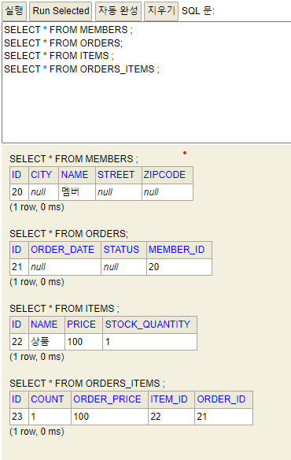

# 실전 예제 2. 연관관계 매핑 시작 
## [전체 JPA 문서](index.md)
## [5. 연관관계 매핑 기초](5.연관관계_매핑_기초.md#실전-예제-2-연관관계-매핑-시작)
## [코드](https://github.com/tkaltk123/jpa_practical_example)

## 1. 일대다, 다대일 연관관계 매핑 
- 실전 예제 1에서는 외래키를 그대로 속성으로 사용했다. 참조를 사용하도록 다음과 같이 변경한다.
- MemberEntity
```java
package entity;

import javax.persistence.*;
import java.util.ArrayList;
import java.util.List;

@Entity
@Table(name = "MEMBERS")
public class MemberEntity {
    @Id
    @GeneratedValue(strategy = GenerationType.AUTO)
    @Column(name = "ID", nullable = false)
    private Long id;

    @Column(name = "NAME")
    private String name;

    @Column(name = "CITY")
    private String city;

    @Column(name = "STREET")
    private String street;

    @Column(name = "ZIPCODE")
    private String zipcode;

    @OneToMany(mappedBy = "member")                         
    private List<OrderEntity> orders = new ArrayList<>();   

    public Long getId() {
        return id;
    }

    public void setId(Long id) {
        this.id = id;
    }

    public String getName() {
        return name;
    }

    public void setName(String name) {
        this.name = name;
    }

    public String getCity() {
        return city;
    }

    public void setCity(String city) {
        this.city = city;
    }

    public String getStreet() {
        return street;
    }

    public void setStreet(String street) {
        this.street = street;
    }

    public String getZipcode() {
        return zipcode;
    }

    public void setZipcode(String zipcode) {
        this.zipcode = zipcode;
    }

    public List<OrderEntity> getOrders() {
        return orders;
    }

    public void setOrders(List<OrderEntity> orders) {
        this.orders = orders;
    }
}
```
- OrderEntity
```java
package entity;

import util.OrderStatus;

import javax.persistence.*;
import java.util.Date;
import java.util.List;

@Entity
@Table(name = "ORDERS")
public class OrderEntity {
    @Id
    @GeneratedValue(strategy = GenerationType.AUTO)
    @Column(name = "ID", nullable = false)
    private Long id;

    @ManyToOne                          
    @JoinColumn(name = "MEMBER_ID")     
    private MemberEntity member;        

    @Temporal(TemporalType.TIMESTAMP)
    @Column(name = "ORDER_DATE")
    private Date orderDate;

    @Enumerated(EnumType.STRING)
    @Column(name = "STATUS")
    private OrderStatus status;

    @OneToMany(mappedBy = "order")              
    private List<OrderItemEntity> orderItems;   

    public Long getId() {
        return id;
    }

    public void setId(Long id) {
        this.id = id;
    }

    public MemberEntity getMember() {
        return member;
    }

    public void setMember(MemberEntity member) {
        if (this.member != null)
            this.member.getOrders().remove(this);
        if (member != null)
            member.getOrders().add(this);
        this.member = member;
    }

    public Date getOrderDate() {
        return orderDate;
    }

    public void setOrderDate(Date orderDate) {
        this.orderDate = orderDate;
    }

    public OrderStatus getStatus() {
        return status;
    }

    public void setStatus(OrderStatus status) {
        this.status = status;
    }

    public List<OrderItemEntity> getOrderItems() {
        return orderItems;
    }

    public void setOrderItems(List<OrderItemEntity> orderItems) {
        this.orderItems = orderItems;
    }
}
```
- OrderItemEntity
```java
package entity;

import javax.persistence.*;

@Entity
@Table(name = "ORDERS_ITEMS")
public class OrderItemEntity {
    @Id
    @GeneratedValue(strategy = GenerationType.AUTO)
    @Column(name = "ID", nullable = false)
    private Long id;

    @ManyToOne
    @JoinColumn(name = "ORDER_ID")
    private OrderEntity order;

    @ManyToOne
    @JoinColumn(name = "ITEM_ID")
    private ItemEntity item;

    @Column(name = "ORDER_PRICE")
    private Integer orderPrice;

    @Column(name = "COUNT")
    private Integer count;


    public Long getId() {
        return id;
    }

    public void setId(Long id) {
        this.id = id;
    }

    public OrderEntity getOrder() {
        return order;
    }

    public void setOrder(OrderEntity order) {
        if (this.order != null)
            this.order.getOrderItems().remove(this);
        if (order != null)
            order.getOrderItems().add(this);
        this.order = order;
    }

    public ItemEntity getItem() {
        return item;
    }

    public void setItem(ItemEntity item) {
        this.item = item;
    }

    public Integer getOrderPrice() {
        return orderPrice;
    }

    public void setOrderPrice(Integer orderPrice) {
        this.orderPrice = orderPrice;
    }

    public Integer getCount() {
        return count;
    }

    public void setCount(Integer count) {
        this.count = count;
    }
}
```
## 2. 객체 그래프 탐색
- 다음 로직 실행
```java
    private static void logic(EntityManager em) {
        var member = new MemberEntity();
        member.setName("멤버");
        em.persist(member);

        var order = new OrderEntity();
        order.setMember(member);
        em.persist(order);

        var item = new ItemEntity();
        item.setName("상품");
        item.setPrice(100);
        item.setStockQuantity(1);
        em.persist(item);

        var orderItem = new OrderItemEntity();
        orderItem.setOrder(order);
        orderItem.setItem(item);
        orderItem.setCount(1);
        orderItem.setOrderPrice(100);
        em.persist(orderItem);

        System.out.println("ordered member name : "+order.getMember().getName());
        System.out.println("ordered item#1 name : "+order.getOrderItems().get(0).getItem().getName());
    }
```
- 실행 결과
```sql
Hibernate: 
    call next value for hibernate_sequence
Hibernate: 
    call next value for hibernate_sequence
Hibernate: 
    call next value for hibernate_sequence
Hibernate: 
    call next value for hibernate_sequence
ordered member name : 멤버
ordered item#1 name : 상품
Hibernate: 
    /* insert entity.MemberEntity
        */ insert 
        into
            MEMBERS
            (CITY, NAME, STREET, ZIPCODE, ID) 
        values
            (?, ?, ?, ?, ?)
Hibernate: 
    /* insert entity.OrderEntity
        */ insert 
        into
            ORDERS
            (MEMBER_ID, ORDER_DATE, STATUS, ID) 
        values
            (?, ?, ?, ?)
Hibernate: 
    /* insert entity.ItemEntity
        */ insert 
        into
            ITEMS
            (NAME, PRICE, STOCK_QUANTITY, ID) 
        values
            (?, ?, ?, ?)
Hibernate: 
    /* insert entity.OrderItemEntity
        */ insert 
        into
            ORDERS_ITEMS
            (COUNT, ITEM_ID, ORDER_ID, ORDER_PRICE, ID) 
        values
            (?, ?, ?, ?, ?)
```
- 
## 발생 오류
1. `NULL not allowed for column ~~`
   - H2에서 키 생성 전략을 IDENTITY로 두면 발생
   - AUTO로 전환 후 시퀸스를 사용하니 해결
2. 키 중복 문제
   - `hibernate.hbm2ddl.auto` 옵션을 create로 뒀는데 시퀸스는 지워지고 데이터가 제대로 지워지지 않아서 발생
   - update로 변경 후 해결
## [맨 위로](#)